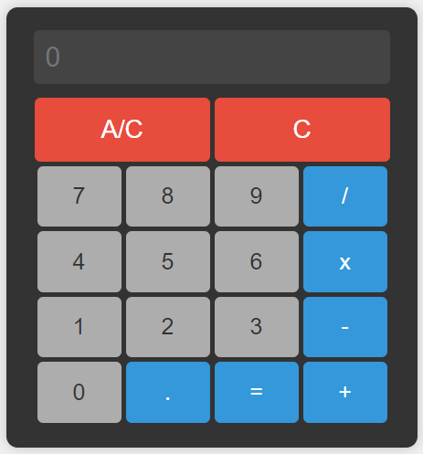

# Basic calculator

  
    

Basic calculator project made in Angular 16.2.0

## Features

- On-screen display of operations.
- Addition, subtraction, multiplication and division functionalities.
- Delete all or delete only the last digit functionality.

## Installation

1. Download the source code of the project
2. Install the dependencies with `npm install`.
3. Start the development server with `ng serve`.

## Use

Access the application through your browser at `http://localhost:4200`

## Deployment

The project is deployed on Vercel at the following URL: [https://basic-calculator-sigma.vercel.app/](https://basic-calculator-sigma.vercel.app/).

## Project features

The project has the following features to ensure best practice and proper operation:

1. Application optimised with Esbuild and standalone components.
2. Eslint and Prettier set up.
3. Husky configured to pre-commit and commit-msg.
4. Each time a commit is made, `ng lint --fix` will be automatically executed.
5. Each time a commit is made, the message will be checked for compliance with the commitlint conventions: feat, fix, docs, refactor, style, chore.
6. Github actions configured for unit-test and lhci, every time a push is made the unit and lighthouse tests will be executed, making the push invalid if it does not meet the indicated standards.
7. Changelog and release-it configured for version control of the application, which can be reflected in Github tags and CHANGELOG.md.

## Test coverage
A report can be run with `npm run coverage`
- Functions    : 87.5% ( 7/8 )
- Lines        : 93.75% ( 30/32 )